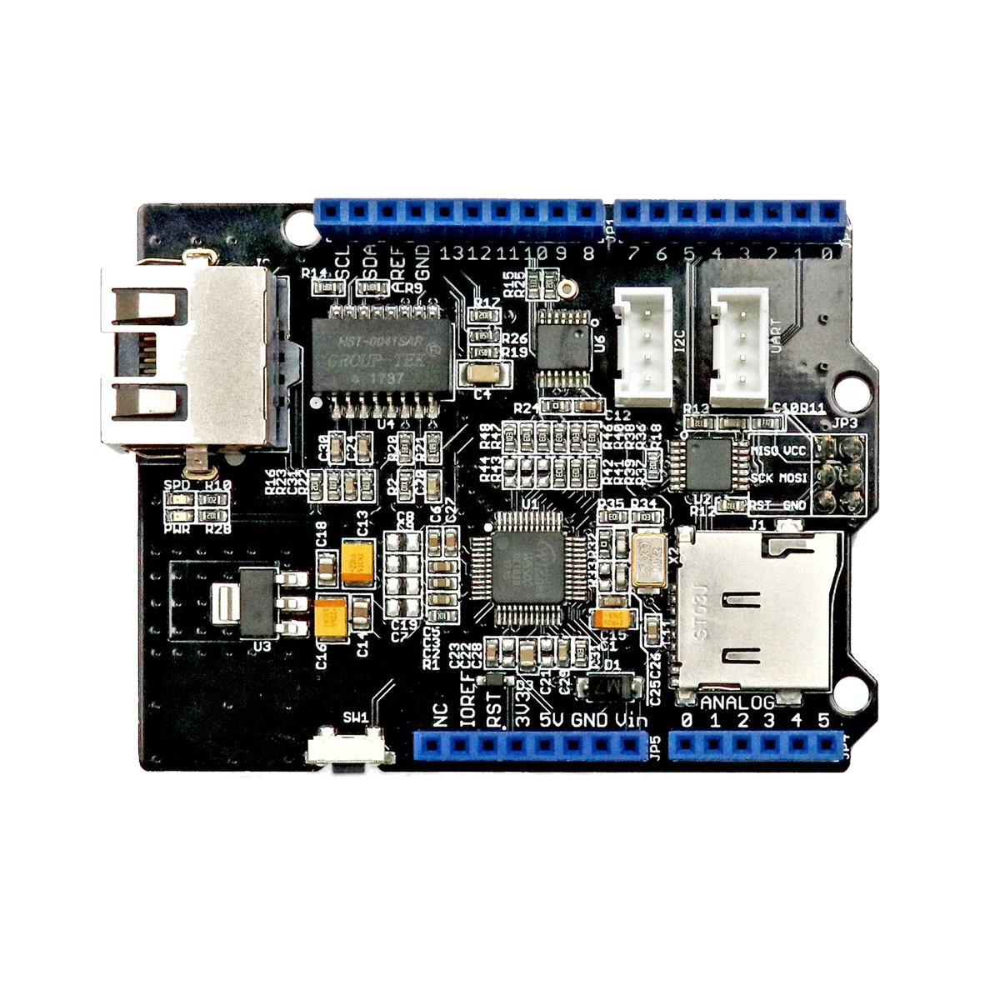

# Ethernet Shield

## Beschreibung
Das Ethernet Shield ist eine Erweiterungsplatine für Arduino-ähnliche Mikrocontroller. Diese Erweiterungsplatinen werden im Allgemeinen als „Shield“ bezeichnet und werden einfach auf den entsprechenden Controller oder Einplatinencomputer gesteckt. Diese vereinfachen das Anschließen von speziellen Komponenten enorm.

Diese spezielle Ausführung erweitert einen Arduino um einen Ethernet-Anschluss. Dadurch kann der Mikrocontroller in ein LAN-Netzwerk eingebunden werden und damit auch beispielsweise Sensordaten ins Internet streamen. Dieses Modul ist ebenfalls der Grundstein für jedes Internet-of-Things-Projekt.

Alle weiteren Hintergrundinformationen sowie ein Beispielaufbau und alle notwendigen Programmbibliotheken sind auf dem offiziellen Wiki (bisher nur in englischer Sprache) von Seeed Studio zusammengefasst. Zusätzlich findet man über alle gängigen Suchmaschinen durch die Eingabe der genauen Komponentenbezeichnung entsprechende Projektbeispiele und Tutorials.

 

## Beispiele

!!!show-examples:./examples/

<!-- infolist -->

## Wichtige Links für die ersten Schritte:

- [Seeed Studio Wi](http://wiki.seeedstudio.com/W5500_Ethernet_Shield_v1.0/)[ki - Ethernet Shield](http://wiki.seeedstudio.com/W5500_Ethernet_Shield_v1.0/)
- [Adafruit - Arduino Ethernet and SD card - Overview](https://learn.adafruit.com/arduino-ethernet-sd-card)

## Weiterführende Hintergrundinformationen:

- [Ethernet - Wikipedia Artikel](https://de.wikipedia.org/wiki/Ethernet)
- [Internet-of-things - Wikipedia Artikel](https://de.wikipedia.org/wiki/Internet_der_Dinge)
- [GitHub-Repository: Ethernet Shield](https://github.com/MakeYourSchool/69-Ethernet-Shield)

